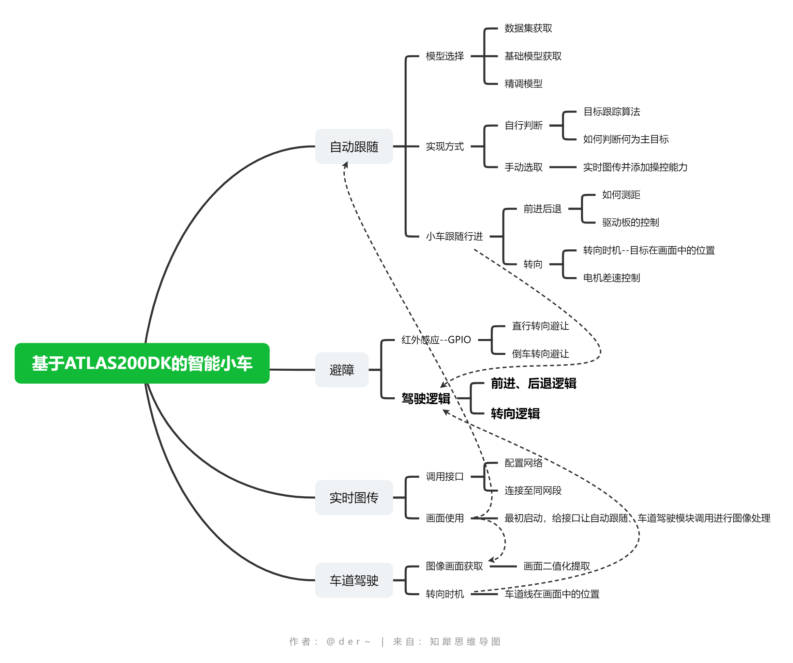

# ATLAS200dk参考代码链接

GPIO：https://gitee.com/ascend/samples/blob/master/python/level1_single_api/5_200dk_peripheral/gpio/src/gpio.py

I2C：https://gitee.com/ascend/samples/blob/master/python/level1_single_api/5_200dk_peripheral/i2c/src/i2c.py

整体项目参考：https://gitee.com/ascend/samples/tree/master/cplusplus/contrib/Ascbot

该项目有手机APK遥控，实现物体跟随、车轨道循线、防跌落功能，在此之上调用接口以及训练新模型，实现额外功能

### 整体项目框架图v1.0

